# Hey, I'm David 👋

**Full Stack Engineer & DevOps** — Node.js · Next.js · React · TypeScript · Docker · CI/CD

 

  

### Stack

 

### Live Projects

| | |
|---|---|
| 🚀 **[Superstack](https://superstack.co.za)** | Software agency & product studio |
| 🌐 **[davidsampson.tech](https://www.davidsampson.tech/)** | Personal site & portfolio |
| 🚕 **[Tazxi](https://tazxi.co.za)** | Tax tool |
| 🤖 **[Remote Copilot](https://remote-copilot.vercel.app)** | Control a coding/DevOps agent in VS Code from your phone |
| ☁️ **[AWS 360 Quiz Tool](https://www.awsquiztool.com/)** | AWS certification prep & practice exams |

 

📫 **davesampson15@gmail.com**

